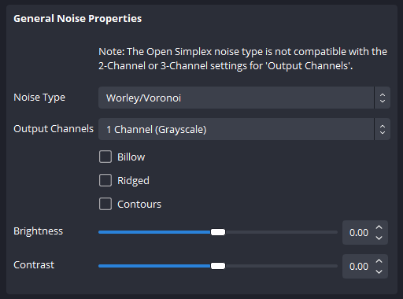
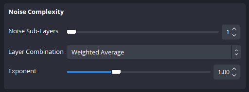

<h1 align="center">
    
</h1>

    <i align="center">A fractal noise generation and displacement plugin for OBS.</i>

<h4 align="center">
    
    
    
    
     
    
    
</h4>

> **Note**
> While we only release new versions of Noise after testing it on local hardware, there are bugs and issues that will slip through. If you happen to run into any issues, please [open an issue](https://github.com/finitesingularity/obs-noise/issues) and we will work to resolve it.

## Introduction

The Noise Plugin for OBS provides fractal noise sources and displacement filters for generating real-time special effects in OBS.

- 📺 The Noise Plugin provides a source for generating dynamic and user tunable fractal noise textures.
- 5️⃣ Avaliable are Five different base noise types including [block noise](#block-noise), [linear value noise](#linear-noise), [smoothstep value noise](#smoothstep-noise), [Open Simplex noise](#open-simplex-noise), and [Worley/Voronoi noise](#worleyvoronoi-noise).
- 🧮 The plugin allows the user to [tune dozens of parameters](#noise-source) to create countless different effects and textures.
- 🤯 The plugin also provides [plenty of presets](#presets) that can then be tuned to dial in exactly the visual effect you are aiming for.
- ➡️ Finally, the plugin also includes a [noise displacement filter](#noise-displacement-filter) that uses dynamically generated noise to displace pixels in the filtered source.

## Installation

Go to the [Releases Page](https://github.com/FiniteSingularity/obs-noise/releases), click `Assets` under the latest release, and select either the Windows, MacOS, or Linux installer. Download the file, and run it, to install for your copy of OBS.

## Fractal Noise
The OBS Noise plugin uses Fractal Noise to generate sources and displacement filters. Fractal noise is a powerful tool used to create realistic and complex textures or patterns that mimic natural phenomena like clouds, fire, or smoke. Think of it as a digital artist's paintbrush for generating intricate detail.

Imagine zooming into a small section of a picture and finding that it looks remarkably similar to the entire picture. That's a key characteristic of fractal noise. It's created by repeating noise patterns at different scales and blending them together. This repetition and blending give the appearance of natural randomness and complexity.

Fractal noise algorithms generate these patterns mathematically, allowing artists to control parameters like scale, complexity, and color to achieve the desired effect. The result is often visually stunning, adding depth and realism to visual effects in video and static images alike.

## Noise Types
Fractal Noise is built from a base noise generation algorithm. Different noise types can be used to create a very wide range of noise visual styles. The noise plugin provides 5 different noise types to use.

### Block Noise
Block noise is a rectangular grid where each grid cell has a randomly generated color value. The algorithm smoothly transitions the grid cell from one color to the next as time changes. The user can control the grid cell dimensions and the rotation of the generated noise field. Block noise can be used for generating regular/man-made textures such as brushed metal or digital pixelation.

### Linear Noise
Linear noise starts with a block noise grid, then linearly smooths the color value between grid points. This results in connected ridges and sharp peaks throughout the noise field. Like the block noise type, the user can adjust the width, height, and rotation of the underlying noise field. While not typically used as a single layer, linear noise is a computational inexpensive way to generate natural looking textures when used fractally.

### Smoothstep Noise
Smoothstep noise is similar to linear noise but uses a smoother interpolation function to get rid of sharp peaks/ridges.  This yields a much smoother noise field, and can generate similar natural textures, sometimes with fewer fractal layers, but at a higher per-layer computational cost.

### Open Simplex Noise
Open Simplex noise has a more rounded look than smoothstep, and in a single layer can have the appearence of ripples in water. The algorithm uses gradients rather than values to generate smoothly changing noise textures. Open Simplex is more computationally expensive than the prior noise types, but still should perform well on lower end systems.

### Worley/Voronoi Noise
Worley/Voronoi noise is also known as cellular noise for its natrual/biological cell-like appearance. When combined with the billow, ridged, and contours options, a wide variety of natural textures from bubbling lava to the surface of a star can be generated. This algorithm is the most computationally expensive, and can be taxing on lower-end GPUs. 

## Noise Source
The plugin provides a `Noise Source` that can be added to any scene, and generates a dynamic fractal noise based texture using one of the user-selectable noise types described above. The user has control over the source dimensions, noise type, and many fractal parameters including number of fractal layers, displacement, rotation, and scaling among other settings. Along with fractal settings, the user can implement domain warping, and can control the evolution of the noise field. The following user changable fields are provided

### Source Properties
The source properties group allows the user to change the dimensions of the generated source using a `width` and `height` parameter defined in pixels.

### Presets
The Noise Plugin provides a set of prebuilt noise source effects in the form of presets.  Simply click the dropdown and select a preset to set all of the values in source properties. After selecting a preset, you can tweak any source properties to achive the desired effect.

In addition to the presets distributed with the plugin, you can export your own effects by clicking the "Save current settings to file" button.  After exporting, you can import those settings by clicking on the preset dropdown and selecting load from file, then browse to the saved file using the file browse field that should appear below.

### General Noise Properties
This section allows the user to set the noise type, output type/channels, toggle transformation settings such as billow and contours, and change the brightness and contrast of the resulting noise texture.

- **Noise Type:** Select one of the [five available noise types](#noise-types) for the base fractal noise generation.
- **Output Channels:** Select one of the following output types:
  - **Color Map:** Allows user to provide to colors create a gradient to map to the noise value.
  - **1-Channel (greyscale):** A single black/white noise texture.
  - **2-Channel:** Provides independent noise textures in the red and green color channels. Useful for things like x/y displacement in other plugins.
  - **3-Channel:** Provides independent noise textures in all three (red, green, blue) color channels. Creates a rainbow-like noise texture.
- **Billow:** Post-processes noise texture to created a billowed or bubbling effect.
- **Ridged:** Post-processes noise texture by inverting color values, when combined with the `Billow` setting, creates ridges in the noise texture.
- **Contours:** Post-processes noise texture to divide the noise field into a number of user-specified contours, giving the effect of a topographical map.
- **Number of Contours:** If `Contours` is enabled, this field allows the user to specify the number of contours to split the noise field into.
- **Brightness:** A post-processed brightness adjustment for the noise texture.
- **Contrast:** A post-processed contrast adjustment for the noise texture.

### Transformation
These settings allow the user to apply global transformations to the resulting noise texture including position, rotation, and base pixel size.

- **Base Offset X/Y:** Allows the user to shift the resulting noise texture in the X and Y direction using units of pixels.
- **Rotation:** Allows rotation of the resulting noise texture from its center point (which will be shifted by the `Base Offset` values).
- **Base Pixel Width/Height:** Changes the "pixel" width and height of the top layer/base noise grid.

### Noise Complexity
The noise complexity settings specify the general fractal parameters for the generated noise texture specifically the number of fractal sub-layers and how those layers are combined.

- **Noise Sub-layers:** This setting specifies how many noise sub layers are generated and combined fractally.  Depending on the transformation `Base Pixel Width/Height`, anything over 6 or 7 layers will not have much effect.
- **Layer Combination:** Sets how layers are combined.
  - **Weighted Average:** Uses the sub-layer setting in the [Subscale Properties](#subscale-properties) as a weight to average noise sub layers.
  - **Max Value:** Uses the maximum noise value of all layers as the output noise value.
- **Exponent:** Exponent applied to the noise field curve.

### Subscale Properties
These settings allow the user to specify how each sub-layer's scale and position is transformed and how much influence each sub-layer has on the resulting fractal noise. Note that the values specified here are multiplicative, so each subsequent layer will be scaled/positioned based on the prior layer.

- **Influence:** The weight used for the `Weighted Average` `Layer Combination` setting. Higher values put more emphasis on sub-layers, while lower values put more on the base layer.
- **Width/Height Scale:** Scales the noise grid "pixel" width/height of each sub layer by the provided percentage. For example, if the base pixel size is 100px, and the user provides a width/height scale of 50%, the first sub-layer will have a grid size of 50px, the second 25px, and so on.
- **Displace X/Y:** Displacement in pixels for each subsequent layer.
- **Rotation:** Rotation in degrees for each subsequent layer.

### Domain Warping
Domain warping is a technique where a generated noise texture is warped using another function. Currently this plugin provides noise based displacement warping which uses multiple iterations of noise to warp/displace the output texture. In these settings the user can define how many iterations of noise to be used and the scale of the warping applied.

- **Iterations:** The number of iterations used to warp. Note- for each iteration, a completely new noise field is generated, thus increasing GPU usage signficantly. Larger numbers of iterations are only practical on higher-end GPUS.
- **Strength X/Y:** Defines how many pixels the maximum displacement/warping will be at each iteration.

### Evolution
These settings define how the noise field evolves.

- **Speed:** The speed at which the noise field evolves.
<!-- - **Seed:** A seed value for generating unique noise fields. -->

## Noise Displacement Filter
The Noise Plugin also provides a Noise Displacement filter that can be applied to sources. This filter uses a generated noise field as a map to displace pixels in the filtered source. This can yield visual effects such as viewing a source under the surface of water, applying sketch/wiggle effects to text, and creating randomly changes edges on things like color sources. Combined with the advanced mask plugin, the Noise Displacement Filter allows for complex masking and reveals.

The Noise Displacement filter has all of the same settings as the noise source filter, with the exception of the Source Size properties, and with the addtion of the Displacement Properties.  In addition, the Noise Displacement filter provides displacement specific presets and export files.

### Displacement Properties
These properties allow the user to specify the maximum magnitude of source pixel displacement that the noise field applies in pixels.

- **Scale X/Y:** The distance (in px) that a source pixel will be displaced by the maximum noise value. The minimum noise value will displace the pixel by the negative value of the scale.
